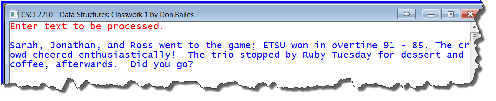
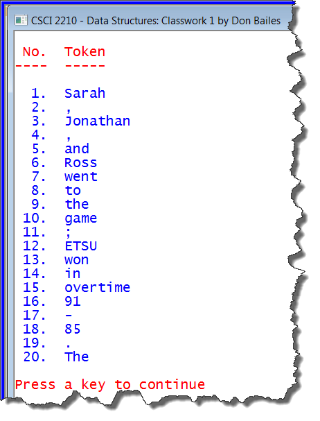
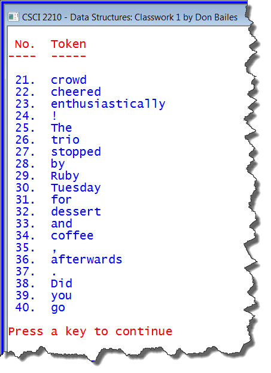
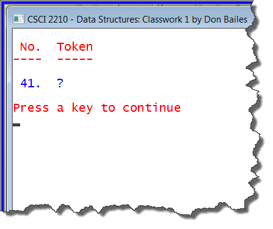

Classwork Tokenize

## Task

Create a **public static Tools** class with at least one **public static
method** named **Tokenize**. The **Tokenize** method must accept two **string
parameters**: the first is the **string** to be “tokenized” while the second is
a **string** containing all **delimiters** to be used in the process. The
**Tools** class can have as many other **public** and **private static methods**
(such as **PressAnyKey**, **WelcomeMessage**, **GoodbyeMessage**, etc.) as you
wish.

For the purpose of this task, the **tokens** should include **all** of the
located **delimiters** except the space and all of the “**words**” between
delimiters. **Discard leading** and **trailing spaces** at each stage, if any.

The **Driver** class will demonstrate the **Tokenize** method by inputting a
**string** of arbitrary length, applying the **Tokenize** method to the string
using a blank space and the punctuation marks and mathematical operators on a
typical keyboard as delimiters. The resulting **array** of tokens should be
displayed one per numbered line.

## Specifications

-   The console window should have a white background with medium blue text (red
    text can be used for contrast or emphasis). The caption on the window should
    be as shown in the screenshots but with your name.

-   The **Split** method in the **String** class **will not work** for this
    purpose because it discards the delimiters it finds. You will need to write
    your own similar method using methods and properties of the **String** class
    such as **Substring**, **IndexOf**, **IndexOfAny**, **IsNullOrEmpty**,
    **Empty**, **PadLeft, PadRight, Remove**, **Trim**, and so forth.

-   Use the capabilities of the **String** class rather than “brute force”. **Do
    NOT** process the input string one character at a time. Use **Visual
    Studio’s Help** facility as needed.

-   The header for the **Tokenize** method should be:

>   public static **String[
>   ]** **Tokenize** (string **line**, string **delims**)

-   The **Driver** class should input a **string** of arbitrary length from the
    console, apply the **Tokenize** method to it, and display the **tokens**
    found in a manner similar to the screenshots below. Note that an **input
    string** can “wrap” at the end of a line; it does not end until and end of
    line character (Enter key) is typed.

-   The **Driver** class may contain as many methods in addition to **Main** as
    needed. Do not allow **Main** to become too large or complex. **Refactor**
    as needed.

-   Be sure to document all of your code as described in the **Documentation
    Policy** on the course website. Fill in appropriate details as needed.
    Failure to document properly will result in penalties (see **Policy**). You
    are strongly urged to document as you work rather than waiting until you
    have completed your program or run out of time.

## Hints

-   In addition to delimiters listed above, the **end of the input string** is
    also a **delimiter**. That is, it is **not** required that the last
    character in the input string be a punctuation mark.

-   In the **Tokenize** method, find the first **delimiter**. There are three
    possibilities.

    -   No **delimiter** was found. The **rest of the string** is the **last
        token**. Add it in the collection of **Tokens**.

    -   A **delimiter** is found in **first column**. Store it in the collection
        of **Tokens**.

    -   A **delimiter** is found, **not** in the **first column**. Everything up
        to the delimiter is a **token**; save it in the **array**.

-   In the latter two cases above, once the **token** is stored in the
    **array**, remove it from the **input string** and repeat the process on the
    **rest** of the **string** until the remaining **string** is **empty**.

-   If your **Tokenize** method grows beyond about 30-35 lines, it is probably
    more complex than necessary.

## Some Sample Screenshots

