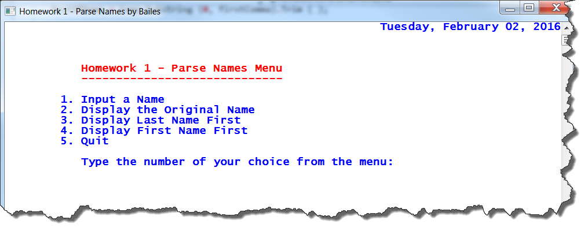

Purpose
=======

Write, test, and run a *C\#* program using the current version of *Visual
Studio*. The program will use a **menu-driven** approach and give you experience
working with the *string class*. Significant use of the *help files* will be
necessary to learn to use the full capabilities of the *string* class.

Figure : Example of a Menu

Specification
=============

Write, debug, test, and run a fully documented (see the *Documentation
Standards* document on the course web site) *C\#* program that uses and
manipulates string objects appropriately in solving this problem. The program
will display a menu similar to the following one.

>   *Main Menu – Homework One*

1.  *Input a Name*

2.  *Display the Name with the Last Name First*

3.  *Display the Name with the Last Name Last*

4.  *Display the Name as Originally Entered*

5.  *Quit*

The name may be entered in any form typically used for names. Examples include
the following.

Will E. Makit M. Smart chauncey c. chauncey, iii

>   Betty Wont Kute, U. R. Morton Downey, Jr

>   Ima Raven Nutt Colder, Ben, Jr. McPherson Mack Pherson, MD

>   Thayer B. Fuddled Badly, Claude Sue N. Lawyer, JD

>   U. Ara Pursun Dr. Heza Dummox N. Stein, PhD

>   SAM SMITH-JONES mckensie macdonald o’reilly, riley

Menu choice 2 should result in the name being displayed in a form illustrated by
the examples below.

Makit, Will E. Smart, M. Chauncey, Chauncey C., III

Wont, Betty Kute, U. R. , Morton, Jr.

Nutt, Ima Raven Colder, Ben, Jr. Pherson, McPherson Mack, MD

Fuddled, Thayer B. Badly, Claude Lawyer, Sue N., JD

Pursun, U. Ara Dummox, Dr. Heza Stein, N., PhD

Smith-Jones, Sam MacDonald, McKensie O’Reilly, Riley

Menu choice 3 should result in the name being displayed in a form illustrated by
the examples below.

>   Will E. Makit I. M. Smart Chauncey C. Chauncey, III

>   Betty Wont U. R. Kute Morton Downey, Jr.

>   Ima Raven Nutt I. Ben Colder, Jr. McPherson Mack Pherson, MD

>   Thayer B. Fuddled Claude Badly Sue N. Lawyer, JD

>   U. Ara Pursun Dr. Heza Dummox I. N. Stein, PhD

>   Sam Smith-Jones McKensie MacDonald Riley O’Reilly

If the user selects items 2, 3, or 4 before item 1 is selected for the first
time, a message should be displayed notifying the user that a name must be
entered before it may be displayed.

After processing any of items 1 – 4 on the menu, the menu should be redisplayed
allowing the user to make another selection. This process should continue until
the user selects choice five. At that point, the program should be terminated.

The Name Class
==============

Develop a *Name* class that keeps of the name and its components. It should
provide the functionality to decompose and recompose/format any name in any of
the various forms. Only “American” types of names need be handled.

The *Name* class should have a *default constructor*, a *copy constructor*, and
a *parameterized constructor*. The third of these constructors should accept a
*string* representing a *name* in any of the permissible formats and decompose
it appropriately into its components. The case of the letters in the name
components should be adjusted so that, when displayed, the names appear
correctly.

Hints
=====

Develop appropriate classes for this assignment including the *Name* class, a
*driver* class, and the *Utility* class below as well as any others that seem
appropriate.

Always use the methods of the *string* class to assist in the task of
decomposing and recomposing the string, and do **NOT** try to do everything by
brute force. In particular, **DO NOT** *process the names one character at a
time*.

When designing a program, remember that each method should address only one
cohesive issue. For example, a method that reads a set of records from a file,
places them into an array, sorts the array, processes the data in each
individual record, and displays a report is not well conceived. Refactor long
methods into several shorter more cohesive methods.

For this program and every project done for this course, your program should
initially display a “*Welcome Message*” that identifies the program, the author,
the author’s e-mail address, the course, and the assignment. It should also
contain a paragraph or so describing the purpose of the program and giving any
specific information the user needs in order to interact with the program
effectively.

When the program is being terminated, it should display an “*Exit Message*”
containing an appropriate message along with any final totals, statistics, or
other information that make sense for the project. Both the *Welcome* and *Exit*
messages should be formatted attractively, be easy to read, and clearly convey
the necessary information.

Create *static* utility methods (in their own class) for purposes such as the
welcome and exit messages. Any method that seems likely to be useful in more
than one project this semester is a candidate for inclusion in this class.
*Welcome* and *Exit* are two good candidates for inclusion in your *static
Utility* class.

The *Menu* class may reside in the same namespace as this *Utility* class.

Your classes should use *properties* rather than private *attributes* with
separate public *setters* and/or *getters* where appropriate.
